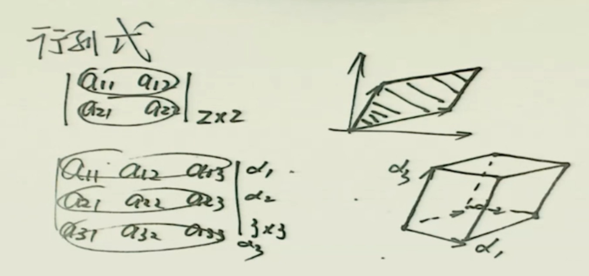
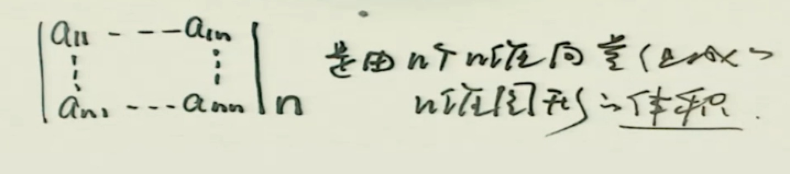

# determinant

<!-- ## 行列式几何理解 -->
<!--  -->
<!--  -->

## 行列式计算

$$
\begin{vmatrix}
a_{11} & a_{12}
\\
a_{21} & a_{22}
\end{vmatrix}

= + a_{11}a_{22} - a_{12}a_{21}
$$

$$
\begin{vmatrix}
a_{11} & a_{12} & a_{13}
\\
a_{21} & a_{22} & a_{23}
\\
a_{31} & a_{32} & a_{33}
\end{vmatrix}

= + a_{11}a_{22}a_{33} + a_{12}a_{23}a_{31} + a_{13}a_{21}a_{32}
 - a_{13}a_{22}a_{31} - a_{12}a_{21}a_{33} - a_{11}a_{23}a_{32}
$$

## 行列式

### 1.具体型行列式 aij已给出

- 化为“12+1”★
- 加边法
- 递推法★
- 数学归纳法

### 2.抽象型 aij未给出

- 用行列式性质(7大性质)
- 用 C=AB★ , C=A+B
- 用相似★ $\Lambda1 = \lambda_{1}\lambda_{2} ... \lambda_{n}$

### 3.代数余子式★

- 行列式
- 矩阵
- 特征值

大于3阶

代数余子式
$$
A_{ij}=(-1)^{(i+j)}M_{ij}
$$

#### 化为“12+1”★

$$
\begin{vmatrix}
a_{11} &  & *
\\
&\diagdown&
\\
O &  & a_{nn}
\end{vmatrix}

=

\begin{vmatrix}
a_{11} &  & O
\\
&\diagdown&
\\
* &   & a_{nn}
\end{vmatrix}

=

\begin{vmatrix}
a_{11} &  & O
\\
&\diagdown&
\\
O &  & a_{nn}
\end{vmatrix}

=

a_{11} ... a_{nn}
$$

$$
\begin{vmatrix}
* &  & a_{1n}
\\
&\diagup&
\\
a_{n1} &  & O
\end{vmatrix}

=

\begin{vmatrix}
O & ... & a_{1n}
\\
&\diagup&
\\
a_{n1} & ... & *
\end{vmatrix}

=

\begin{vmatrix}
O &  & a_{1n}
\\
&\diagup&
\\
a_{n1} &  & O
\end{vmatrix}

=
(-1)^{\frac{n(n-1)}{2}}
a_{1n}...a_{n1}
$$

$$
\begin{vmatrix}
A &  C
\\
O  & B
\end{vmatrix}

=

\begin{vmatrix}
A &  O
\\
C  & B
\end{vmatrix}
=

\begin{vmatrix}
A &  O
\\
O  & B
\end{vmatrix}

=
\begin{vmatrix}
A
\end{vmatrix}

\begin{vmatrix}
B
\end{vmatrix}
$$

$$
\begin{vmatrix}
C &  A
\\
B  & O
\end{vmatrix}

=

\begin{vmatrix}
O &  A
\\
B  & C
\end{vmatrix}
=

\begin{vmatrix}
O &  A
\\
B  & O
\end{vmatrix}

=
(-1)^{mn}
\begin{vmatrix}
A
\end{vmatrix}

\begin{vmatrix}
B
\end{vmatrix}

注:A是m阶矩阵  B是n阶矩阵
$$

范德蒙德行列式(盯着第二行看)
$$
\begin{vmatrix}
1 & 1 & ... & 1
\\
x_1 & x_2 & ... & x_n
\\
x_1^2 & x_2^2 & ... & x_n^2
\\
... & ... & & ...
\\
x_1^{n-1} & x_2^{n-1} & ... & x_n^{n-1}
\end{vmatrix}

=

\prod_{1 \leqslant i < j \leqslant n} (x_j-x_i)

$$

注：范氏行列式转置

$$
\begin{vmatrix}
1 & x_1 & x_1^2  & ... & x_1^{n-1}
\\
1 & x_2 & x_2^2 &... & x_2^{n-1}
\\
... & ... & ... & & ...
\\
1 & x_n &  x_n^2 & ... & x_n^{n-1}
\end{vmatrix}

=

\prod_{1 \leqslant i < j \leqslant n} (x_j-x_i)

$$
